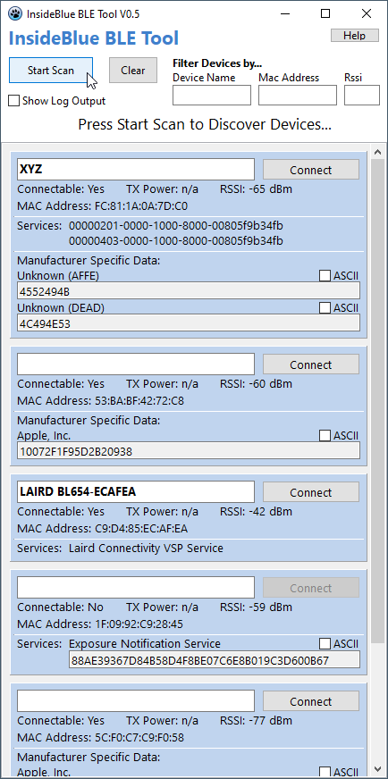
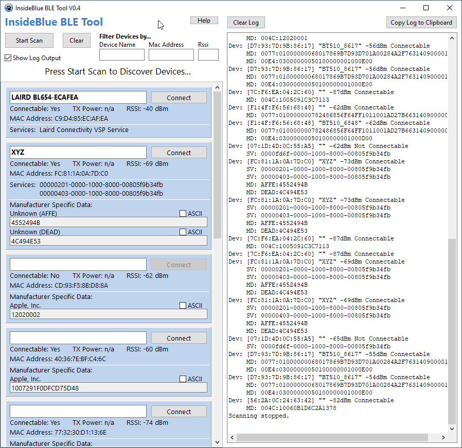
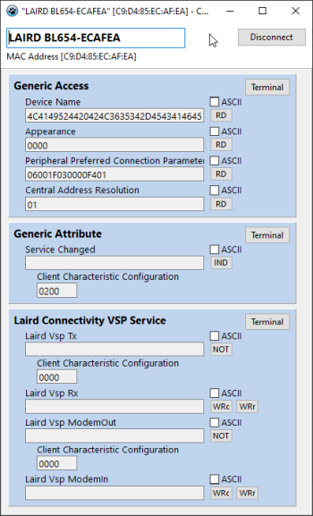
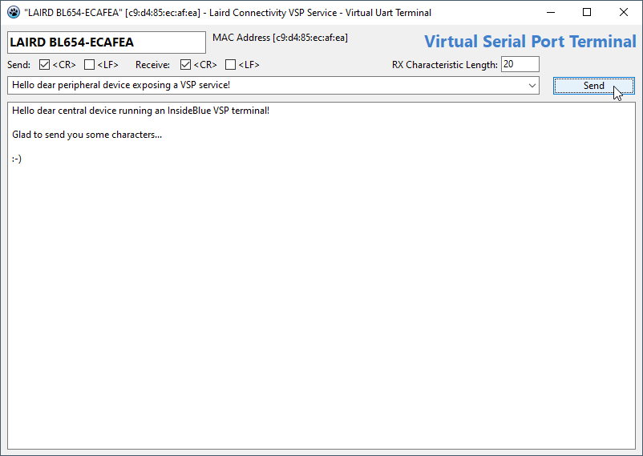

# InsideBlue BLE Tool V0.8
Welcome to **InsideBlue BLE Tool**, an easy to use Windows BLE application for Bluetooth Low-Energy (BLE) connectivity leveraging the PC’s integrated Bluetooth adapter. It's actually cross-platform, see below for Linux and Max OS support.

You can scan for BLE devices that are advertising and discover their GAP services or manufacturer specific data, engage a connection and access the peripheral GATT table.

## Main Scan Window
After start the main scan window opens and provides common controls for BLE device discovery.

### Start/Stop Scanning
Pressing the **Start Scan** button starts scanning for BLE advertisments. Discovered devices will be shown as a panel list underneath. After scanning has started, the button turns into a **Stop Scan** button and BLE scanning stops when pressed again. The **Clear** button clears the panel list of discovered devices.

### Filters
Three filters can be applied to the device scanning. Entering a device name or part of it into the left field will only show devices matching. The device name is not case-sensitive. The middle field filters for BLE mac addresses or part of it. The mac address has to be entered as hex numbers separated by colons (aa:bb:cc:dd:ee:ff). The right field allows filtering based on the RSSI value of received advertisements which – to some extent – represents the distance of a device. Values have to be entered as positive numbers.

### Log Output
A more detailed log output can be enabled by ticking the Show Log Output box. The main window will extend to the right and show the log output.
Two additonal buttons allow clearing the log output as well as copying the log output into the clipboard. You can also directly select text in the log output and copy.

### Scan Data Panel
For each discovered device a panel with device information is shown. It contains device name, connectable status, tx power (if available), RSSI value, mac address, advertised services as well as manufacturer specific data.

If the UUID of a service or the company ID in the manufacturer data is known in the official Bluetooth list of assigned numbers, the official name will be shown. You can hover with the mouse over the name to see the underlying service UUID or full company name with ID.

Manufacturer data can be displayed either as HEX numbers (default) or ASCII string. For ASCII non-printable characters are displayed as black boxes.

### Connect Device
If a device is connectable you can engage a connection with the Connect button. This button is only available if the device does advertise with connectable flags active.

## Device Connect Window
After connecting a new device specific window opens and the GATT table of the device is read. Services, characteristics and descriptors are shown in a panel structure grouped by services.

If the UUID of a service, characteristic or descriptor is known in the official Bluetooth list of assigned numbers, the name will be shown. You can hover with the mouse over the name to see the underlying UUID number.

Depending on the properties of each characteristic different buttons get added to the text field. Those are Read, WriteCommand, WriteRequest, Notify and Indicate.

Data from/to a characteristic gets displayed or entered into a text field, which is either read/write or read only. You can switch the presentation between HEX numbers or ASCII string. When set to ASCII, non-printable characters are displayed as a black square.

### Virtual Serial Port (VSP)
Beside the official Bluetooth list of assigned numbers for services, there exist proprietary services to indicate a virtual serial port service (similar to SPP service from Bluetooth Classic). InsideBlue knows some of these and if recognized it will show their names as well along with a button to fire up a simple VSP terminal window. Please find below a list of manufactures and proprietary GATT services / characteristics which are currently supported.

1. **Laird Connectivity** with the [Virtual Serial Port (VSP)](https://www.lairdconnect.com/documentation/application-note-laird-custom-ble-serial-port-service),
2. **u-blox** with the [u-connectXpress BLE Serial Port Service](https://content.u-blox.com/sites/default/files/u-connectXpress-LowEnergySerialPortService_ProtocolSpec_UBX-16011192.pdf),
3. **Nordic Semiconductors** with the [Nordic UART Service (NUS)](https://developer.nordicsemi.com/nRF_Connect_SDK/doc/1.4.0/nrf/include/bluetooth/services/nus.html).

If a certain VSP service is missing, please raise an [issue](https://github.com/eriklins/InsideBlue-BLE-Tool/issues) to get it added.

## UART VSP Terminal
For known VSP services you can open a terminal window and send/receive text. Line endings can be selected for both send and receive individually. Each sent text line will be added to a history drop down menu and can be selected later for sending certain lines again.

(Currently only one VSP terminal can be opened at a time.)

### Line Endings
You can set line endings for send (`<cr>` and/or `<lf>` will be appended to the send string) and receive (new line will be added to the receive window on `<cr>`, `<lf>` or closing curly bracket of e.g., a JSON string).

### Modem In/Out Characteristics
Beside the mandatory TX (from peripheral to central) and RX (from central to peripheral) characteristics, some VSP services offer additional Modem In/Out characteristics which are used for handshake signalling much like RTS/CTS signals on a real UART.

### Length of RX Characteristic
The length of the peripheral RX characteristic is not known to the central, hence when sending text lines with too many characters, the BLE write operation will fail. By default the characteristic length is set to the used MTU size -3, which is a known good guess.

### WriteCommand/WriteRequest
Depending on the write properties of the RX characteristic you can select to use either write request or write command, if both are exposed.

## Pairing Devices
On operating systems, initiating a connection procedure will automatically run pairing if necessary. This process is entirely managed by the operating system, there isn't much that we can do from the user side.

This has the following implications:
- The user will need to manually confirm pairing, until that happens no successful access to protected characteristics is possible.
- Removing a device can only be done from the OS Bluetooth settings page.
- There is no programmatic way of controlling this process.

Note(s): This applies at least for Windows OS and might be different on other OS platforms.

## Limitations
- Since InsideBlue leverages the PC’s integrated Bluetooth Controller, this ultimately limits what’s achievable from a BT hardware perspective (e.g., number of simultaneous connections).
- It is not possible to tweak BLE settings like scan interval and/or scan window or similar low-level BLE parameters.
- Due to a limitation of the underlying BLE library, it’s not possible to properly receive notifications or indications from devices exposing an identcal GATT table (i.e. identical service/characteristic UUIDs). This will be fixed in an upcoming release.
- The underlying BLE library does not yet expose properties of the descriptors and hence it’s not yet possible to directly read/write them.

## Releases / Installation
You can download pre-built binaries for Windows 64 bit, 32 bit and Linux 64 bit from the [releases tab](https://github.com/eriklins/InsideBlue-BLE-Tool/releases). 

InsideBlue BLE Tool does not require any installation. Just unzip anywhere and run. The ZIP includes the executable, two shared library files and a help file.

## Building InsideBlue BLE Tool
This project is implemented with the [Lazarus IDE](https://www.lazarus-ide.org/) and [FreePascal](https://www.freepascal.org/). Lazarus is a free Delphi compatible cross-platform IDE for Rapid Application Development (RAD). FreePascal is a mature, versatile, open source Pascal compiler.

InsideBlue BLE Tool was built with Lazarus IDE v3.99 (trunk) and FreePascal 3.3.1 on Windows 10 x86_64 and Ubuntu 22.04.3 LTS.

Mac OS would be supported from both Lazarus/FreePascal as well as SimpleBLE library perspective. However, I did not yet look into this in detail. Feel free to raise an [issue](https://github.com/eriklins/InsideBlue-BLE-Tool/issues) if interested. 

## BLE Library
Inside Blue BLE Tool uses the [SimpleBLE library](https://github.com/OpenBluetoothToolbox/SimpleBLE) and corresponding [Pascal bindings](https://github.com/eriklins/Pascal-Bindings-For-SimpleBLE-Library).

## Releases
Pre-built releases for Windows 64/32 bit and Linux 64 bit are available on the [releases tab](https://github.com/eriklins/InsideBlue-BLE-Tool/releases).

## Contributing/Feedback
Feedback / improvements / pull-requests / etc. are welcome!

## License
Copyright (C) 2023 Erik Lins

This project is released under the MIT License.
